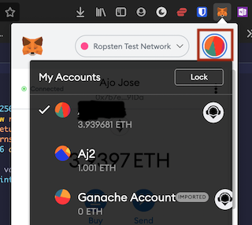
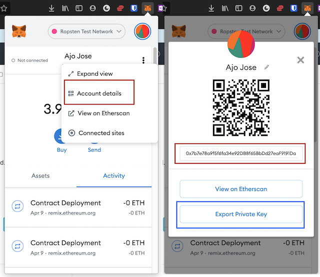

# ERC20 Token Distribution

<!-- One Paragraph of project description goes here  -->
A nodeJS application for distributing ethereum tokens from owner to differnet accounts by reading a text file containing a list of ethereum address.

## Getting Started

These instructions will get you a copy of the project up and running on your local machine for development and testing purposes. 
<!-- See deployment for notes on how to deploy the project on a live system. -->

### Prerequisites

<!-- What things you need to install the software and how to install them -->
* **Node v15.8.0** - Node.js is an asynchronous event-driven JavaScript runtime used to run JavaScript applications. Installation instructions can be found in the [docs](https://nodejs.org/en/download/package-manager/)
* **MetaMask Account + Ropsten Ethers** - Metamask is a software cryptocurrency wallet used to interact with the Ethereum blockchain. Metamask should be installed as a browser add-on. It can be downloaded from [here](https://metamask.io/). Ropsten is a test network for testing smart contracts.
* **Remix IDE** - It is a powerful open source tool that helps you write Solidity contracts straight from the browser. We can access the IDE by going to this address: https://remix.ethereum.org


### Setup

A step by step series of examples that tell you how to get the application running

1. Create a Metamask account and add some test ethers to that account.

    * Detailed instructions can be found in these websites. [Setup Metamask](https://medium.com/@alias_73214/guide-how-to-setup-metamask-d2ee6e212a3e), [Create additional accounts](https://metamask.zendesk.com/hc/en-us/articles/360015289452-How-to-Create-an-Additional-Account-in-your-MetaMask-Wallet), [Get Test Ethers](https://medium.com/swlh/deploy-smart-contracts-on-ropsten-testnet-through-ethereum-remix-233cd1494b4b)

2. Create an infura ethereum endpoint for ropsten test network.

    * Instructions for creating an infura account and setting up endpoint can be accessed from [here](https://nimbus.guide/infura-guide.html). When selecting the type of endpoint, please select Ropsten.


3. Deploy the smart contract [Sovereign_Contract.sol](Sovereign_Contract.sol) onto the ropsten test network using Remix IDE with the account just created in the previous step.

    * Select the created account in metamask

    

    * Select Ropsten Test Network from the dropdown

     

    * Go to remix,create new file with .sol extension and copy the code from the [Sovereign_Contract.sol](Sovereign_Contract.sol) file to newly created file in Remix IDE.

    

    * Go to solidity compiler section in remix and choose the correct version of compiler specified in the code and click the compile button

    

    * Go to deploy & run transaction section, choose environment as injected web3, then in the account section choose the same account as selected in the metamask. In contract dropdown select Sovereign token. Then click the deploy button to deploy the contract on to the ropsten network.


    

    * A metamask notification window will popup asking confirmation for the contract creation. Click confirm button to deploy.

4. Configure app.js file with contract address, metamask account address and private key, infura endpoint, abi.

    * The deployed contracts address can be found from metamask. From the activity tab select the the contract. Then click on the view on etherscan button. This will take you on to the etherscan page. From that page contract address can be found (red rectangle)


      


    * Metamask account address and private key can be found from the account details screen. account address (red rectangle). By clicking the export private key button, private key can be retrieved.

          

    * ABI (Application Binary Interface) can be found from remix.

           

    * Replace all these params into app.js file with your own infura endpoint(red), abi(blue), metamask acoount addres,private key and contract address(yellow)

          

## Usage
1. First clone the repository
```bash
git clone https://github.com/ajojose11/blockchain_project.git
```
2. Go to the folder
```bash
cd blockchain_project
```
3. Run the install command
```bash
npm install
```
4. Run application

```bash
node app.js
```
5. When prompted enter the name of file containing accounts.

## Docker

1. In the cloned directory, enter command to build docker image

```bash
docker build -t blockchain_project .
```

2. Run the container

```bash
docker run -ti blockchain_project
```

## Docker Hub

1. Run docker pull command to get the latest image from docker hub

```bash
docker pull ajojose11/ajo_nodejs_blockchain_project_nci:latest
```

2. Run the container

```bash
docker run -ti ajojose11/ajo_nodejs_blockchain_project_nci:latest
```

## Docker Hub URL:  https://hub.docker.com/repository/docker/ajojose11/ajo_nodejs_blockchain_project_nci


